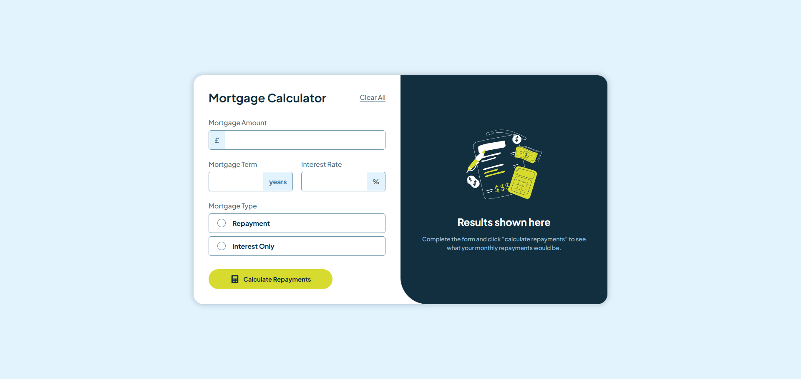

# 💷 Frontend Mentor - Solución del reto Mortgage repayment calculator

Esta es mi solución al reto [Mortgage repayment calculator](https://www.frontendmentor.io/challenges/mortgage-repayment-calculator-Galx1LXK73).

## Tabla de contenidos

- [Resumen](#resumen)
  - [El reto](#el-reto)
  - [Captura de pantalla](#captura-de-pantalla)
  - [Enlaces](#enlaces)
- [Mi proceso](#mi-proceso)
  - [Construido con](#construido-con)
  - [Lo que aprendí](#lo-que-aprendí)
  - [Desarrollo continuo](#desarrollo-continuo)
  - [Recursos útiles](#recursos-útiles)
- [Autor](#autor)
- [Agradecimientos](#agradecimientos)

## 💻 Resumen

### El reto

Los usuarios deberían poder:

- Introducir información sobre la hipoteca y visualizar los importes de pago mensual y total tras enviar el formulario
- Ver mensajes de validación del formulario si algún campo está incompleto
- Completar el formulario utilizando únicamente el teclado
- Visualizar la disposición óptima de la interfaz según el tamaño de pantalla del dispositivo
- Ver los estados de _hover_ (al pasar el cursor) y _focus_ (al enfocar) de todos los elementos interactivos de la página

### Captura de pantalla

### Enlaces

- URL de la solución: https://github.com/angeldavid04/mortgage-repayment-calculator
- URL del sitio en vivo: https://angeldavid04.github.io/mortgage-repayment-calculator

## 💪 Mi proceso

### Construido con

- HTML5 semántico
- JavaScript ES6+
- Propiedades personalizadas de CSS
- Grid
- Flexbox

### Lo que aprendí

Aprendí a utilizar el evento input usando delegación de eventos. También descubrí una forma de crear elementos radio button personalizados de forma accesible, así como estilizarlos con CSS por medio del label.

Descubrí varios atributos de elementos del DOM y su utilidad.

Aprendí a utilizar varios atributos de accesibilidad para formularios como aria-checked, aria-live y role.

### Desarrollo continuo

Espero poder seguir aprendiendo más aspectos sobre HTML, CSS Y JavaScript. Igualmente me gustaría mejorar mi forma de maquetación en general.

### Recursos útiles

- [MDN Web Docs](https://developer.mozilla.org/es/) - Este recurso es muy bueno y me ayuda sobre todo a escoger funciones y características que funcionan en cualquier navegador.
- [W3Schools](https://www.w3schools.com/cssref/pr_gen_quotes.php) - Este recurso me ayuda a entender las propiedades CSS cuando tengo dudas.
- [CSS Scan - CSS box shadow examples](https://getcssscan.com/css-box-shadow-examples) - Este recurso me ayuda a escoger sombras para elementos.

## 🤓 Autor

- Frontend Mentor - [Angel López](https://www.frontendmentor.io/profile/AngelDavid-dev)

## ♥️ Agradecimientos

Le quiero dar un agradecimiento a mis maestros del bachillerato porque sin ellos no sería quien soy ahora, JonMircha por ser un gran docente digital y enseñarme los fundamentos del desarrollo web, y a Lucas Dalto por ofrecerme muy buenos cursos para aprender y repasar.
